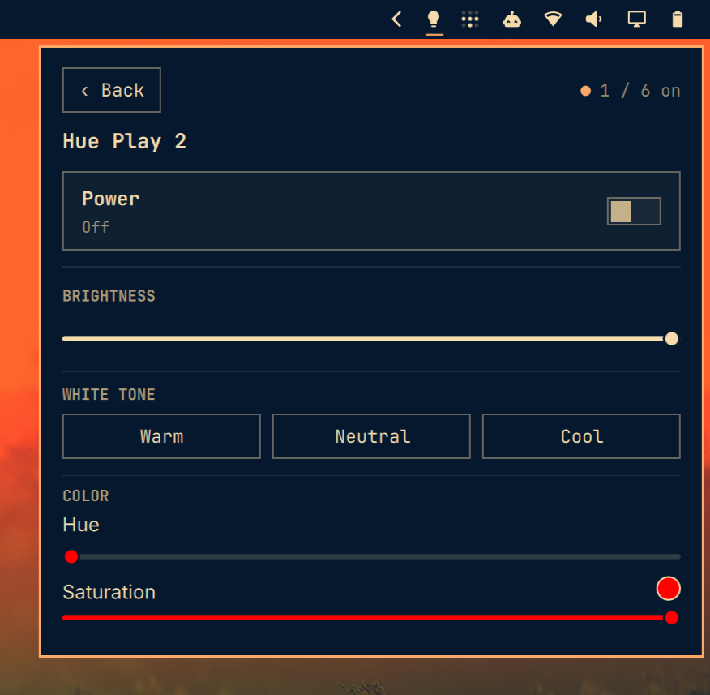

# Philips Hue for the Omarchy bar

Control Philips Hue lights directly from the Omarchy bar through the local Hue Bridge API v2. After initial bridge discovery, status queries and control commands remain on the local network and do not require a cloud account.



## Requirements

- Omarchy Quattro with the plugin-capable shell
- A Philips Hue Bridge on the same local network
- Python 3

## Install

```sh
omarchy plugin add https://github.com/workingtitle/omarchy-hue.git --enable
```

The widget is placed in the right bar section by default. Move it when desired:

```sh
omarchy bar move io.github.workingtitle.hue --section right
```

The bar icon is shown only while a Hue Bridge is present on the local network.
After pairing, the plugin additionally requires at least one reachable Hue light.
Presence checks use local SSDP discovery and the local Hue Bridge API; the cloud
discovery endpoint is used only by the manual **Find bridge** setup action.

## Pair the bridge

1. Select the light bulb icon in the Omarchy bar.
2. Select **Find bridge**, or enter the bridge's local IP address manually.
3. Press the large link button on the Hue Bridge.
4. Select **Pair** within 30 seconds.

The generated Hue application key is stored outside the plugin repository with mode `0600` in `~/.config/omarchy/hue/config.json`.

## Usage

Left-click the bar icon to open the panel. Right- and middle-click intentionally have no action. The overview lists only reachable lights and provides **All on** and **All off** actions. Select a light to open its detail view.

The detail view provides power and brightness controls. Depending on the light's capabilities, it also offers hue and saturation controls plus **Warm**, **Neutral**, and **Cool** white-tone presets. Hover a slider and use the mouse wheel or a two-finger touchpad gesture to adjust its value.

Unreachable lights are filtered using the Zigbee connectivity state reported by the bridge.

## Update

```sh
omarchy plugin update io.github.workingtitle.hue
```

## Remove

```sh
omarchy plugin remove io.github.workingtitle.hue
```

Removing the plugin does not delete the Hue application key. To revoke access completely, remove the application from the Hue app or delete the corresponding bridge user, then delete `~/.config/omarchy/hue/config.json`.

## Security

Omarchy plugins run unsandboxed with user permissions. This plugin executes its bundled Python client and communicates with the configured Hue Bridge over the local network. All bridge API and pairing requests use HTTPS with the Philips Hue bridge root CAs pinned in the client. The bridge certificate's ID must match the bridge ID returned by the authenticated TLS connection; that ID is stored alongside the application key and is checked on every later request. A pairing response is validated before the application key is stored.

HTTP responses are bounded before JSON parsing, including error and discovery responses, and resource, light, name, and displayed error sizes are limited. Dynamic bridge data is rendered as plain text in the panel. Initial automatic discovery uses `https://discovery.meethue.com/` only for the manual **Find bridge** setup action. It does not request elevated privileges, install packages, or execute downloaded code.

The pinned roots follow Philips Hue's [HTTPS application design guidance](https://developers.meethue.com/develop/application-design-guidance/using-https/).

## License

[MIT](LICENSE)
